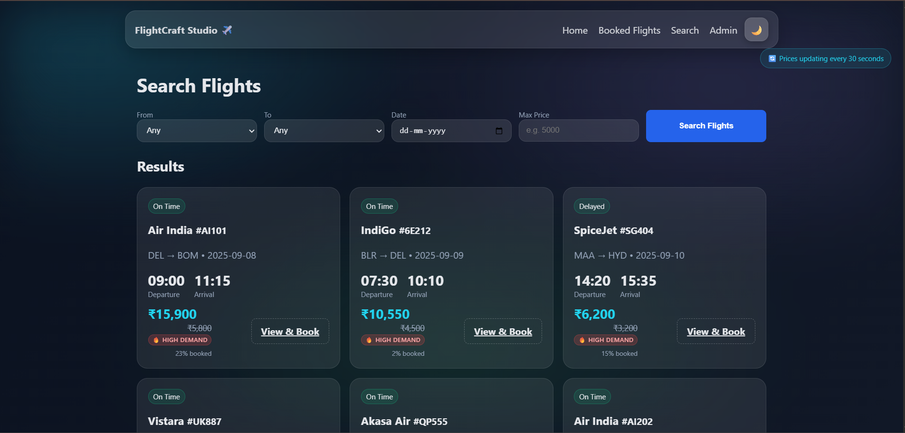

# FlightCraft Studio ✈️ - Flight Reservation System

A comprehensive **Flask-based flight reservation system** with modern web interface, REST API, and comprehensive testing framework. This production-ready application provides complete flight booking functionality with dynamic pricing, seat management, and receipt generation.


## 🌟 Key Features

- **🖥️ Modern Web Interface**: Responsive HTML/CSS/JS frontend with intuitive booking workflow
- **🔌 Complete REST API**: 16+ endpoints for flight search, booking management, and system utilities
- **💰 Dynamic Pricing Engine**: Real-time price calculation based on occupancy, demand, and timing
- **🎫 Receipt Generation**: PDF and JSON receipt downloads with QR code integration
- **👑 Admin Dashboard**: Complete flight and booking management interface
- **🧪 Comprehensive Testing**: 50+ automated tests with Playwright and pytest
- **📱 Cross-browser Support**: Tested on Chromium, Firefox, and WebKit

## 🚀 Technical Stack

- **Backend**: Flask 2.2+, SQLAlchemy 3.0+, SQLite database
- **Frontend**: HTML5, CSS3, JavaScript (Vanilla JS)
- **Testing**: Playwright 1.40+, pytest 7.4+, Coverage.py
- **Documentation**: Markdown documentation with API specs
- **Dependencies**: Pillow, ReportLab, QRCode, Faker

## 📋 Core Functionality

### Flight Management
- Flight search with advanced filtering (origin, destination, date, price, airline)
- Real-time seat availability and booking
- Dynamic pricing based on occupancy and demand
- Flight status tracking and gate information

### Booking System
- Multi-step booking workflow with seat selection
- Passenger information management
- Payment simulation and confirmation
- PNR generation and booking retrieval
- Booking cancellation with seat release

### Admin Features
- Secure admin authentication
- Flight CRUD operations (add, edit, remove)
- Booking oversight and management
- System statistics and revenue tracking
- Real-time dashboard updates

### API Layer
- **Flight APIs**: Search, details, seat availability, pricing
- **Booking APIs**: CRUD operations, status management
- **Utility APIs**: Airports, airlines, system statistics
- **Search APIs**: Enhanced filtering and dynamic pricing

## 🧪 Testing Framework

- **50+ Test Cases** covering all system components
- **Cross-browser Testing** (Chromium, Firefox, WebKit)
- **API Testing** for all REST endpoints
- **Integration Testing** for complete workflows
- **UI Testing** for frontend functionality
- **Receipt Testing** for PDF/JSON generation
- **80% Code Coverage** requirement

## 📁 Project Structure

```
flight-booking-simulator/
├── flight_reservation_system/          # Main Flask application
│   ├── app.py                         # Flask routes and API endpoints
│   ├── models.py                      # SQLAlchemy database models
│   ├── templates/                     # HTML templates
│   ├── static/                        # CSS, JS, and assets
│   └── requirements.txt               # Python dependencies
├── tests/                             # Comprehensive test suite
│   ├── test_ui_*.py                   # UI automation tests
│   ├── test_api_endpoints.py          # API validation tests
│   ├── test_integration_workflows.py  # End-to-end tests
│   └── test_receipts.py               # Receipt generation tests
├── API_DOCUMENTATION.md               # Complete API documentation
├── TESTING_DOCUMENTATION.md           # Testing framework guide
├── E2E_TESTING_SUMMARY.md             # Testing implementation summary
└── run_tests.py                       # Test execution framework
```

## 🚀 Quick Start

### Prerequisites
- Python 3.9 or higher
- pip (Python package installer)

### Installation

1. **Clone the repository**
   ```bash
   git clone https://github.com/Manju700/flight-booking-simulator.git
   cd flight-booking-simulator
   ```

2. **Install dependencies**
   ```bash
   pip install -r flight_reservation_system/requirements.txt
   ```

3. **Run the application**
   ```bash
   cd flight_reservation_system
   python app.py
   ```

4. **Access the system**
   - **Web Interface**: http://localhost:5000
   - **API Documentation**: http://localhost:5000/api
   - **Admin Dashboard**: http://localhost:5000/admin (password: admin123)

### Optional: Run Tests

1. **Install testing dependencies**
   ```bash
   pip install -r requirements-test.txt
   ```

2. **Install Playwright browsers**
   ```bash
   python -m playwright install
   ```

3. **Run tests**
   ```bash
   # Quick smoke tests
   python run_tests.py --type smoke
   
   # Full test suite
   python run_tests.py --type all
   ```

## 📚 Documentation

- **[API Documentation](API_DOCUMENTATION.md)**: Complete REST API reference with examples
- **[Testing Guide](TESTING_DOCUMENTATION.md)**: Comprehensive testing framework documentation
- **[Setup Instructions](SETUP_TESTING.md)**: Installation and configuration guide
- **[E2E Testing Summary](E2E_TESTING_SUMMARY.md)**: Testing implementation overview

## 🔌 API Endpoints

### Flight Management
- `GET /api/flights` - List all flights with filtering
- `GET /api/flights/{id}` - Get specific flight details
- `GET /api/flights/{id}/seats` - Get seat availability
- `GET /api/flight/{id}/price` - Get dynamic pricing

### Booking Operations
- `GET /api/bookings` - List all bookings
- `GET /api/bookings/{pnr}` - Get specific booking
- `POST /api/bookings` - Create new booking
- `PUT /api/bookings/{pnr}` - Update booking
- `DELETE /api/bookings/{pnr}` - Cancel booking

### Search & Discovery
- `GET /api/search` - Enhanced flight search
- `GET /api/airports` - Available airports
- `GET /api/airlines` - Airline information
- `GET /api/stats` - System statistics

## 🎯 Use Cases

- **Educational Project**: Learn Flask, SQLAlchemy, and web development
- **Portfolio Showcase**: Demonstrate full-stack development skills
- **API Development**: Study REST API design and implementation
- **Testing Framework**: Learn automated testing with Playwright and pytest
- **Production Template**: Base for real-world flight booking systems

## 🔧 Development Features

- **Database Migration**: JSON to SQLite migration script
- **Environment Configuration**: Flexible configuration management
- **Error Handling**: Comprehensive error management and user feedback
- **Security**: Admin authentication and input validation
- **Performance**: Optimized queries and efficient data handling

## 📊 Project Status

- **Completion**: 98% (Production Ready)
- **Test Coverage**: 80%+ with comprehensive validation
- **Browser Support**: Cross-browser compatibility verified
- **Documentation**: Complete setup and usage guides
- **API Coverage**: All endpoints documented and tested

## 🧪 Testing Categories

- **Smoke Tests**: Critical functionality validation
- **UI Tests**: Frontend interface testing
- **API Tests**: Backend endpoint validation
- **Integration Tests**: End-to-end workflow testing
- **Receipt Tests**: PDF/JSON generation testing
- **Admin Tests**: Management interface testing

## 🎨 Screenshots

### Homepage


### Flight Search


### Booking Process


### Admin Dashboard


## 🤝 Contributing

This project serves as a comprehensive example of modern web development practices. Feel free to fork, modify, and enhance for your own learning or commercial use.

### Development Setup
1. Fork the repository
2. Create a feature branch
3. Make your changes
4. Run tests to ensure everything works
5. Submit a pull request

## 📄 License

This project is open source and available under the [MIT License](LICENSE).

## 🏆 Acknowledgments

- Flask community for the excellent web framework
- Playwright team for the powerful testing framework
- SQLAlchemy for robust database ORM
- All contributors and testers

## 📞 Support

- **Issues**: Report bugs and request features via [GitHub Issues](https://github.com/Manju700/flight-booking-simulator/issues)
- **Documentation**: Check the documentation files in the repository
- **Testing**: Run `python validate_test_setup.py` to verify setup

---

**Perfect for showcasing full-stack development skills, API design, testing frameworks, and production-ready web applications! 🚀**

## 🌟 Star History

[](https://star-history.com/#Manju700/flight-booking-simulator&Date)
